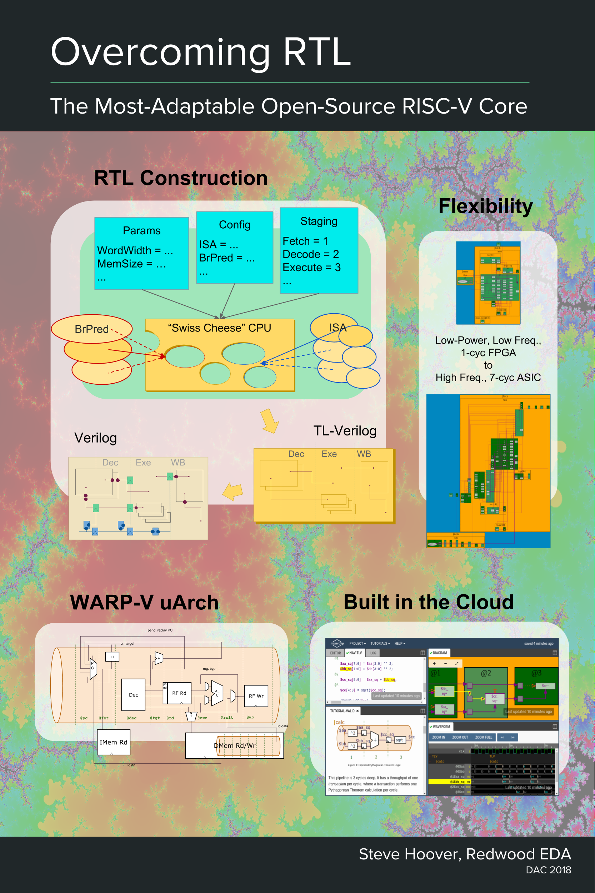

### The open-source RISC-V core IP you can shape to your needs!


# Overview

WARP-V is an open-source CPU core generator written in TL-Verilog with support for RISC-V and MIPS I. It is a demonstration and exploration vehicle for the flexibility that is possible using the emerging "transaction-level design" methodology. It can implement a single-stage, low-power microcontroller or a mid-range 7-stage CPU. Even the instruction-set architectures (ISAs) is configurable. WARP-V is an evolving library of CPU components as well as various compositions of them. It is driven by a community interested in transforming the silicon industry through open-source hardware and revolutionary design methodology.

WARP-V includes CPU core logic only with no current support for virtual memory, caches, or IOs. RISC-V implementations are formally verified using open-source tools in continuous integration testing.


# Quick Links

### Explore WARP-V

WARP-V is easiest to explore in Makerchip. You can:
  - <a href="http://www.makerchip.com/sandbox?code_url=https:%2F%2Fraw.githubusercontent.com%2Fstevehoover%2Fwarp-v%2Fmaster%2Fwarp-v.tlv" target="_blank" atom_fix="_">open the entire WARP-V model as a single file</a>
  - <a href="http://www.makerchip.com/sandbox?code_url=https:%2F%2Fraw.githubusercontent.com%2Fstevehoover%2Fwarp-v%2Fmaster%2Fwarp-v_config.tlv" target="_blank" atom_fix="_">open a small configuration file to explore a given configuration</a>.


### Publications

  - Steve Hoover, "Pipelining RISC-V", Udemy 2018, <a href="http://www.makerchip.com/module/Pane/CourseSlides.pdf" target="_blank" target="_blank" atom_fix="_">webinar</a>
  - Steve Hoover, "Overcoming RTL", DAC 2018: <a href="http://www.makerchip.com/module/pane/DAC2018_WARP-V_Presentation.pdf" target="_blank" target="_blank" atom_fix="_">slides</a>
  - Akos Hadnagy, "Formal Verification of WARP-V", ORConf 2018 and VSDOpen 2018: <a href="https://docs.google.com/presentation/d/e/2PACX-1vQobRU9_QxRI8dguy0U9WYulMJUm4IWjHHKzz9o8nwId-KGiz8pOrTXsAgwjWEI8GLEipMQj2s8ChMy/pub?start=false&loop=false&delayms=30000" target="_blank" target="_blank" atom_fix="_">slides</a>, <a href="https://www.youtube.com/watch?v=fqr4Z9wLNvQ&list=PLUg3wIOWD8yoZLznLfhXjlICGlx2tuwvT&index=14&t=21s" target="_blank">video</a>, and <a href="https://arxiv.org/pdf/1811.12474.pdf" target="_blank" atom_fix="_">paper</a>
  - Steve Hoover: "Verifying a RISC-V in 1 Page of Code!", <a href="https://www.linkedin.com/pulse/verifying-risc-v-1-page-code-steve-hoover/" target="_blank" atom_fix="_">Linkedin</a> and <a href="https://www.semiwiki.com/forum/content/7850-verifying-risc-v-1-page-code-e.html" target="_blank" target="_blank" atom_fix="_">SemiWiki</a>

### Collaboration

  - A Google Drive for this and other <a href="https://drive.google.com/drive/folders/1l9YTvpNZ0km3IlzlPaMvoLdriLw9B8Yk?usp=sharing" target="_blank" target="_blank" atom_fix="_">open-source TL-Verilog projects</a> including some <a href="https://docs.google.com/presentation/d/1tFjekV06XHTYOXCSjd3er2kthiPEPaWrXlHKnS0yt5Q/edit#slide=id.g480b08c3a2_0_11" target="_blank" target="_blank" atom_fix="_">WARP-V block diagrams</a>
  - A <a href="https://gitter.im/librecores/warp-v" target="_blank" atom_fix="_">LibreCores WARP-V Gitter Room</a> for public discussion

  

# Installation

In a clean directory:

```sh
git clone --recurse-submodules https://github.com/stevehoover/warp-v.git
```

Note the use of `--recurse-submodules`. If you already cloned without it, you can:

```sh
cd warp-v
git submodule init
git submodule update
```


# Features

  - Adaptable CPU core implementations (core only, no virtual memory, caches, I/Os)
  - Reconfigurable pipeline (1-7 stages)
  - Customizable ISA, with implementations of RISC-V ISA (RV32I), MIPS I, and a simple string-based ISA for educational use
  - RT-Level implementation detail
  - A simple ~12-instruction test for each ISA
  - For RISC-V ISA:
    - An assembler for hard-coded test programs
    - Formal verification in CI (continuous integration testing)
    - Implementation characterized on AWS data-center FPGAs
  - A small code base (single < 3K-line file (heavily-commented) implements all WARP-V variants, assembler, tests, formal verification harness, and Xilinx implementation)


# Revolutionary Modeling Methodology

As an exploration vehicle for capabilities that are not yet defined in the <a href="http://tl-x.org/" target="_blank" target="_blank" atom_fix="_">TL-Verilog language spec</a>, WARP-V intentionally pushes the limits of code construction using an M4-based flow. While TL-Verilog documentation and tools are fairly mature, the M4 layer intended only for research.an undocumented proof-of-concept framework (even when old-school Verilog features might suffice). If you've come here to learn about TL-Verilog for RISC-V design, you'd be better served to study [the cores developed in the Microprocessor for You in Thirty Hours Workshop](https://github.com/stevehoover/RISC-V_MYTH_Workshop/blob/master/student_projects.md).

WARP-V uses bleeding-edge modeling methodology that provides an unprecedented level of flexibility without sacrificing gate-level control. To understand WARP-V and how to utilize it, it helps to first gain an appreciation for this methodology, which involves two layers:

## TL-Verilog

Transaction-Level Verilog extends Verilog/SystemVerilog with constructs for pipelines, transactions, etc. This provides a convenient modeling framework for parameterization at a higher level, but without sacrificing gate-level control. You can learn more about TL-Verilog at <a href="http://www.makerchip.com/" target="_blank" atom_fix="_">makerchip.com</a>.


## Code Construction with M4

Code construction techniques for TL-Verilog are an active area of research. Before native implementation, code construction is being explored through the use of a macro preprocessor, <a href="https://www.gnu.org/software/m4/" target="_blank" atom_fix="_">M4</a> (plus a bit of Perl). Macro preprocessing is used in WARP-V to enable a single definition of the instruction set to be used to generate:

  - decode logic
  - result selection logic for the execution unit
  - an assembler

Logic related to replay and register bypass is generated based on CPU pipeline configuration.

There are simple uses of M4 that are easy to follow, such as including library files, defining constants, and instantiating macros. M4 features are supported in the [Makerchip IDE](#makerchip) as a short-term solution with some nice features to help with these use models. But M4 use in WARP-V goes *way* beyond these scenarios, intentionally pushing the limits of code construction. A small amount of code does a lot, but it is *very* messy, undocumented, and extremely difficult to debug. So it is important to [give careful consideration to your intended use of WARP-V](#use).


## More Detail

You can learn more about the WARP-V design methodology in <a href="http://www.makerchip.com/module/pane/DAC2018_WARP-V_Presentation.pdf" target="_blank" target="_blank" atom_fix="_">these slides</a>, presented at the Design Automation Conference in June 2018. Below is a corresponding poster.

  


<a name="use"></a>
# Ways to Use WARP-V -- Overview

## Configuring WARP-V

High-level parameters are defined toward the top of the WARP-V file. You can modify parameters and compile from the command line, but it is easier to follow compilation steps and debug problems using the IDE at <a href="http://www.makerchip.com/" target="_blank" atom_fix="_">makerchip.com</a> as [described below](#makerchip). There is no better guide for understanding parameters at this point than code comments.


## Tweaking the uArch

Since M4 macro-preprocessing is not for the faint of heart, once you've got a CPU that's close to what you want, you can take the generated code as source and go from there. Ideally, that would mean using the TL-Verilog as source, since you still get a great deal of flexibility at that level, but if you are stuck in the past, you can start with the Verilog or SystemVerilog.


## Modifying the ISA

Constructing an ISA from scratch would require heavy use of M4 and could be a tall order at this point. Small variations of RISC-V, however, are more feasible by making small adjustments to parameterization.


## RISC-V Infrastructure

For RISC-V development (even if you are developing your own RISC-V core without using WARP-V itself) this repository has some useful infrastructure. It supports formal verification using <a href="https://github.com/cliffordwolf/riscv-formal" target="_blank" target="_blank" atom_fix="_">riscv-formal</a> run in [continuous integration testing](#ci). So, you always know if your core is compliant.

## In the Cloud

WARP-V is implemented on FPGAs in the cloud using the <a href="https://github.com/stevehoover/1st-CLaaS" target="_blank" target="_blank" atom_fix="_">1st CLaaS</a> (custom logic as a service) framework. You can implement your own customized WARP-V on FPGAs in the cloud, too!


## Help

You can find help in the <a href="https://gitter.im/librecores/warp-v" target="_blank" atom_fix="_">LibreCores WARP-V Gitter Chat Room</a>. You might find commercial assistance there as well.


<a name="makerchip"></a>
# Exploring WARP-V in Makerchip

A few pointers for exploring WARP-V in Makerchip:

  - Learn TL-Verilog and Makerchip first, following tutorials and other resources, at <a href="http://www.makerchip.com/" target="_blank" atom_fix="_">makerchip.com</a>.
  - This link will <a href="http://www.makerchip.com/sandbox?code_url=https:%2F%2Fraw.githubusercontent.com%2Fstevehoover%2Fwarp-v%2Fmaster%2Fwarp-v.tlv" target="_blank" atom_fix="_">Open the latest WARP-V in Makerchip</a>.
  - Reverse-engineer the WARP-V design at the TL-Verilog level, not by reading WARP-V source code. Configure WARP-V as you choose, compile, and explore the model in the "Nav-TLV" pane.
  - You can then correlate this back to the source code by clicking Nav-TLV line numbers. This highlights the corresponding source code line... er... well, this doesn't always work in its current form because of the `m4_indirect` macro. You can work around this by replacing them, e.g `m4+indirect(M4_isa['_decode'])` becomes `m4+riscv_decode()`.


# Contributing

Speak up on the <a href="https://gitter.im/librecores/warp-v" target="_blank" atom_fix="_">LibreCores WARP-V Gitter Chat Room</a> and we'll help you find an appropriate way you can help out.

Keep in mind that WARP-V is a horrible starting point for learning TL-Verilog because of its heavy use of M4. If you are interested in microarchitectural contributions, learn TL-Verilog first at <a href="http://www.makerchip.com/" target="_blank" atom_fix="_">makerchip.com</a>.

With a clear understanding of where to tread, you can navigate WARP-V and contribute successfully. WARP-V is a library with plenty of room to grow to cover a more complete spectrum of CPU microarchitecture. Be aware, however, that working with CPU microarchitecture means walking in a minefield of patents. Work with the community to define your contributions.

Work in a fork and submit push requests that have passed continuous integration (CI) testing (below). Your work is much more likely to be accepted if it is aligned with the community and doesn't risk patent infringement.


<a name="formal"></a>
# Formal Verification

WARP-V RISC-V implementations are verified using the <a href="https://github.com/cliffordwolf/riscv-formal" target="_blank" target="_blank" atom_fix="_">riscv-formal</a> open-source formal verification framework. Everything for formal verification is in the `formal` directory. See the <a href="https://github.com/stevehoover/warp-v/tree/master/formal" target="_blank" target="_blank" atom_fix="_">README.md</a> file there.

`formal/Makefile` uses SandPiper(TM) SaaS Edition -- SandPiper running in the cloud as a service. No local SandPiper installation is required (but if the SandPiper SaaS service goes down, the build will fail).

(For other ISAs, <a href="https://upscale.stanford.edu/" target="_blank" target="_blank" atom_fix="_">Upscale</a> might be a good direction for future work.)


<a name="ci"></a>
# CI

<a href="https://travis-ci.com/" target="_blank" atom_fix="_">Travis-CI</a> is used for continuous integration testing: <a href="https://travis-ci.com/stevehoover/warp-v" target="_blank" target="_blank" atom_fix="_">WARP-V Travis CI</a>. CI runs formal verification tests.

### CI Environment

CI uses the `formal/make_env.sh` script to built the necessary tools from source. The result of this build is cached between builds (per branch) using a <a href="https://docs.travis-ci.com/user/caching" target="_blank" target="_blank" atom_fix="_">caching feature of Travis-CI</a>. Caching is applied blindly, without regard to the availability of newer sources. CI scripts will check the latest sources against the ones from the cache and report differences near the end of the log. The cache can be cleared manually from the build page. Look under "More options" (upper-right).

### CI Debug

<a href="https://docs.travis-ci.com/user/running-build-in-debug-mode" target="_blank" target="_blank" atom_fix="_">Debugging Travis-CI failures</a> can be awkward. To simplify things, if a formal check fails, CI scripts attempt to upload the failure traces using https://transfer.sh/. Look for messages near the end of the log file containing links to the uploaded traces for download and debug.


# Data

## Implementation

TODO: Add implementation data here.

## Retiming Experiments

We utilized the pipeline flexibility of TL-Verilog and WARP-V's pipeline parameterization to experiment with Vivado's ability to retime logic optimally. This showed that it is not necessary to precisely partition the CPU pipeline logic among pipeline stages in order to get good quality results. However, when tools must retime logic, runtime can be significantly impacted. Here is [more detail](doc/retiming.md).
