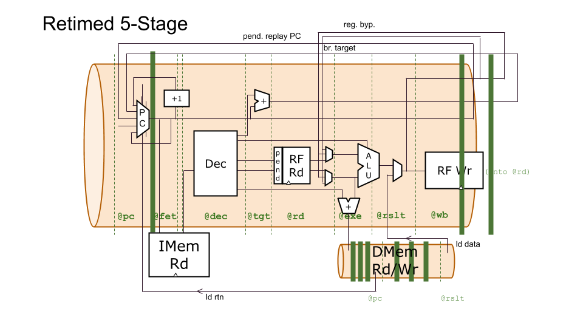

# Retiming Study

We utilized the pipeline flexibility of TL-Verilog and WARP-V's pipeline parameterization to experiment with Vivado's ability to retime logic optimally. For our experiment we squashed all the logic in the pipeline into the first stage to see if Vivado could retime the logic to achieve comparable results to runs with the explicitly-timed logic.

We compared three RISC-V models: a 1-stage, a 5-stage, and modified version of the 5-stage where all pipelined logic was explicitly retimed into the first stage of the pipeline in the source code. This retimed model preserves identical overall behavior. All replays have the same number of bubbles; the register bypass network is left in place; etc. In theory synthesis retiming should be able to restore the original timing (or ideal timing) of the pipelined logic.

In RTL, these models would look very different, but in TL-Verilog, the differences are minor. The retimed TL-Verilog design differs from the 5-stage model only in `@` pipestage identifiers (which come from a few M4 parameters in the source code). This experiment helps to answer the question: "Are the `@` statements in TL-Verilog even functionally necessary?" (Even if the answer is no, there is value in conveying design intent. The overhead for doing so in TL-Verilog is relatively minor, but is significant in RTL.)

If synthesis is not able to retime the logic successfully, we would expect the 5-stage retimed model to require a similar clock period to (and roughly the same area as) the 1-stage model. On the other hand, if synthesis retiming is successful, we would expect the 5-stage retimed model to have an essentially-identical implementation to the 5-stage model.

TODO: Put data here.

Results show that synthesis retiming is successful at least with respect to the quality of results.

Next, we compared runtimes.

TODO: Put data here.

We can see that the runtime is impacted significantly by the need to retime the logic.

## Conclusion

It is not necessary to precisely partition the CPU pipeline logic among pipeline stages in order to get good quality results. However, when tools must retime logic, runtime can be significantly impacted, so it can be valuable to write models that are at least approximately-timed. (And this is also valuable for conveying design intent to help reason about the design.)

## Further Studies

These studies did not use explicit BlockRAMs. Can synthesis retime these?

Repeat experiments with other synthesis tools from other vendors (and open-source).

## To Reproduce

There is a source file for each of these models in the `impl` directory, and they can be compiled by the `impl/Makefile`.
