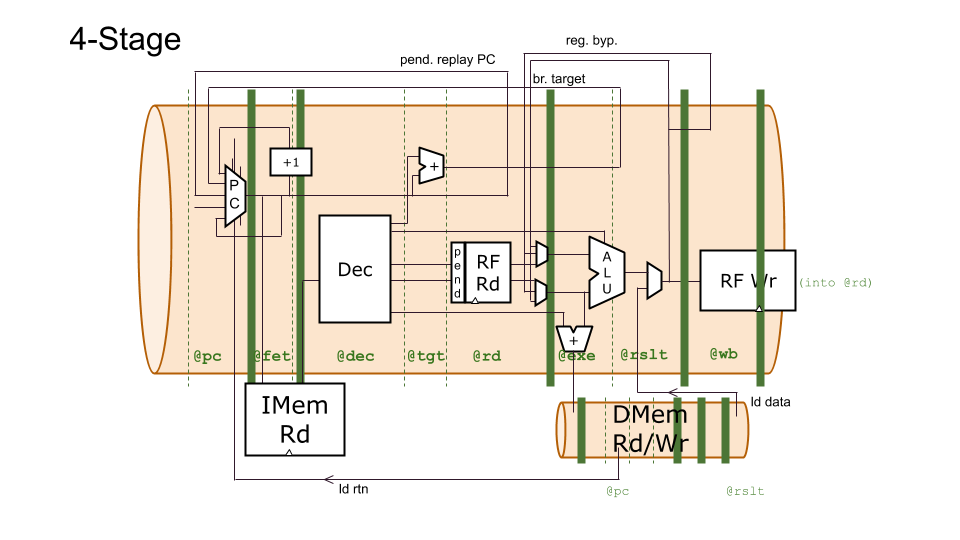
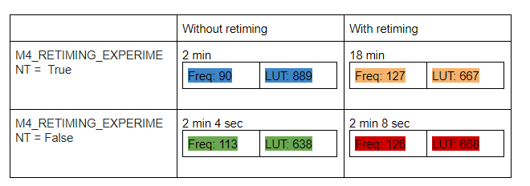
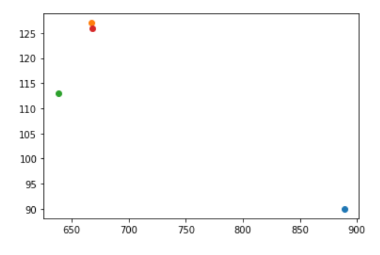

# Retiming Study

We utilized the pipeline flexibility of TL-Verilog and WARP-V's pipeline parameterization to experiment with Vivado's ability to retime logic optimally. For our experiment we squashed all the logic in the pipeline into the first stage to see if Vivado could retime the logic to achieve comparable results to runs with the explicitly-timed logic.

We compared three RISC-V models: a 1-stage, a 4-stage, and an modified version of the 4-stage model (RETIMING_EXPERIMENT = True) where all pipelined logic was placed in the first stage of the pipeline in the source code. This RETIMING_EXPERIMENT model preserves identical overall behavior. All replays have the same number of bubbles; the register bypass network is left in place; etc. In theory synthesis retiming should be able to restore the original timing (or ideal timing) of the pipelined logic.

In RTL, these models would look very different, but in TL-Verilog, the differences are minor. The RETIMING_EXPERIMENT TL-Verilog design differs from the 4-stage model only in `@` pipestage identifiers (which come from a few M4 parameters in the source code). This experiment helps to answer the question: "Are the `@` statements in TL-Verilog even functionally necessary?" (Even if the answer is no, there is value in conveying design intent. The overhead for doing so in TL-Verilog is relatively minor, but is significant in RTL.)

If synthesis is not able to retime the logic successfully, we would expect the RETIMING_EXPERIMENT model to have a similar maximum clock frequency as (and roughly the same area as) the 1-stage model. On the other hand, if synthesis retiming is successful, we would expect it to have an essentially-identical implementation to the 4-stage model.

X: area (LUTs), Y:freq (MHz)

The above data shows the 4-stage models (RETIMING_EXPERIMENT = True/False) with and without retiming enabled. (No retiming uses the DONT_TOUCH attribute to preserve flip-flops vs. default synthesis options which will retime logic.)

Results show that synthesis retiming is successful at least with respect to the quality of results, as the peach and red dots are essentially the same.

Comparing runtimes, however, synthesis took 8.4x longer on the unstaged model.

## Conclusion

It is not necessary to precisely partition the CPU pipeline logic among pipeline stages in order to get good quality results. However, when tools must retime logic, runtime can be significantly impacted.

The level of precision that is appropriate in the source code is a trade-off.

Pros of precisely-timed source:

  - Lower synthesis runtimes
  - Clear design/implementation intent/information conveyed by source code

Cons:

  - More code to write/maintain/comprehend

It can be reasonable to develop a roughly-staged model at first and refine the timing in the source code based on implementation feedback (which is much more feasible in TL-Verilog than in RTL).

## Further Studies

These studies did not use explicit BlockRAMs. Can synthesis retime these?

WARP-V is a simple pipeline. Can synthesis retime across flow components, like a recirculation mux, FIFO, etc. (I doubt it will retime through FIFOs by default as there are RAS considerations.)

Repeat experiments with other synthesis tools from other vendors (and open-source).

Why are frequencies so low. We've seen much better for 4-stage.

## To Reproduce

There is a source file for each of these models in the `impl` directory, and they can be compiled by the `impl/Makefile`.
